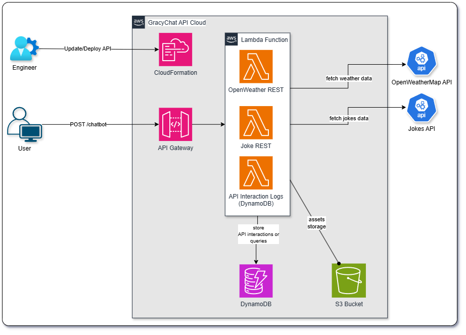

# GracyChat - Multi-Domain Chatbot


GracyChat is a serverless multi-domain chatbot designed to fetch weather information and random jokes. It integrates with the OpenWeatherMap API and the Official Joke API and is fully deployed using AWS CloudFormation with resources such as Lambda, API Gateway, DynamoDB, and S3.

---

## Architecture Overview



Serverless architecture with the following key components:

1. **User Interaction**  
   - Users send POST requests to the `/chatbot` endpoint via API Gateway.

2. **API Gateway**  
   - Receives requests and routes them to Lambda functions.

3. **Lambda Functions**  
   - **Weather Function:** Fetches weather data from OpenWeatherMap.
   - **Joke Function:** Retrieves random jokes from the Official Joke API.
   - **Logging:** Logs each query and its response into DynamoDB for later analysis.

4. **Data Storage and Assets**  
   - **DynamoDB:** Stores interaction logs.
   - **S3 Bucket:** Hosts static assets and packages for Lambda functions.

---

## Project Structure

```shell
gracychat/
├── .env                          # Environment variables
├── .gitignore
├── cloudformation/
│   └── gracychat.yaml            # CloudFormation template for deployment
├── docs/
│   ├── devnotes.txt              # Additional developer notes
│   └── GracyChat-Diagram.png     # Architecture diagram
├── functions/
│   ├── __init__.py
│   ├── api/
│   │   ├── __init__.py
│   │   ├── joke.py              # Joke API integration
│   │   └── weather.py           # Weather API integration
│   ├── config.py                # Configuration and environment settings
│   ├── lambda_function.py       # Main Lambda function
│   └── requirements.txt         # Python dependencies
├── scripts/
│   └── deploy.sh                # Packaging and deployment script
└── README.md
```

## Deployment Guide

Package and deploy GracyChat using the deployment script and CloudFormation template.

### Prerequisites

- **AWS Account:** IAM user with sufficient permissions (e.g., `AdministrationAccess`).
- **AWS CLI:** Installed and configured.
- **Python ≥3.6:** Python ≥3.6 and `venv` are installed.
- **.env File:** Environment variables (e.g., `OPENWEATHER_API_KEY`).

### Local Environment Setup

1. **Clone the Repository:**

```bash
git clone https://github.com/maksha/gracychat.git
cd gracychat
```

2. **Create and Activate the Virtual Environment:**

```bash
python3 -m venv venv
source venv/bin/activate
```

3. **Install Dependencies (for local testing):**

```bash
pip install -r functions/requirements.txt
```

### Packaging and Deployment

The updated deployment process leverages the [scripts/deploy.sh](scripts/deploy.sh) script, which automates:
- Packaging your Lambda function and its dependencies into versioned ZIP files.
- Uploading the packages to an S3 bucket.
- Deploying the AWS CloudFormation stack.

#### Running the Deployment Script

Run the following command from the project root:

```bash
./scripts/deploy.sh -l functions -r functions/requirements.txt -t cloudformation/gracychat.yaml -k YOUR_OPENWEATHER_API_KEY
```

**Parameters:**
- **-l:** Path to the Lambda code directory (default: `functions`).
- **-r:** Path to the `requirements.txt` file (default: `functions/requirements.txt`).
- **-t:** CloudFormation template file (default: `cloudformation/gracychat.yaml`).
- **-b:** S3 bucket name (auto-generated if not provided).
- **-k:** OpenWeatherMap API key (can also be set in the `.env` file).

The script will prompt for any missing parameters and display the configuration before packaging, deploying, and outputting the API endpoint.

### Verifying the Deployment

Once deployment is complete, source the updated environment variables and test the deployed API:

```bash
source .env
curl -X POST -H 'Content-Type: application/json' -d '{"query": "What is the weather in London?"}' "$API_ENDPOINT"
curl -X POST -H 'Content-Type: application/json' -d '{"query": "Tell me a joke"}' "$API_ENDPOINT"
```

Replace `"$API_ENDPOINT"` with the endpoint provided by the deployment output if necessary.

### Testing the API

You can test the chatbot functionality directly using the following curl commands:

- **Weather Request:**

```bash
curl -X POST -H 'Content-Type: application/json' -d '{"query": "What is the weather in London?"}' "$API_ENDPOINT"
```

- **Joke Request:**

```bash
curl -X POST -H 'Content-Type: application/json' -d '{"query": "Tell me a joke"}' "$API_ENDPOINT"
```

---

## Additional Notes

- **Environment Variables:**  
  Make sure your `.env` file includes required keys like `OPENWEATHER_API_KEY`. The deployment script will update this file with the `API_ENDPOINT` once the stack is successfully deployed.

- **TODO:**  
  Explore AWS native deployment solutions for further automation.
